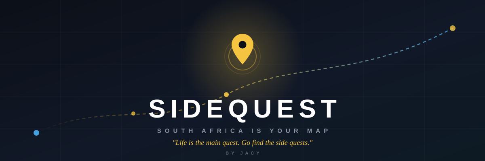

<div align="center">



# SIDEQUEST 🇿🇦

**Your life is the main story. South Africa is your map.**

A free real-world adventure game for students — when the bell rings, or you've just had
enough of class, grab your friends and go find a quest.

<br/>

[](https://github.com/JacyFleisie/sidequest/releases)
[](https://github.com/JacyFleisie/sidequest/releases)
[](https://github.com/JacyFleisie/sidequest/releases/latest/download/SideQuest-debug.apk)
[](https://github.com/JacyFleisie/sidequest)
[](https://github.com/JacyFleisie/sidequest)
[](https://react.dev/)
[](https://www.typescriptlang.org/)

<br/>

[](https://github.com/JacyFleisie/sidequest/releases/latest/download/SideQuest-debug.apk)
[](https://github.com/JacyFleisie/sidequest)

</div>

---

## About

**SideQuest turns all of South Africa into a game board.** With **263 hand-written
quests** across all 9 provinces — from a kota hunt in Soweto and a sunset at Zoo Lake,
to lion-watching in the Kruger and a waterfall in KZN, from the Cradle of Humankind to
a game reserve inside Krugersdorp — every quest you finish maps a little more of the
country.

No accounts. No subscriptions. No paid APIs. Just you, your friends, and the map.

---

## ✨ Features

### 🗺️ Explore the Map
South Africa rendered as a dark game board, with every quest pinned in its real
location. **Search** finds any place or quest — local results first, then live
OpenStreetMap for anything else — and flies you straight to it. The map even
**survives tile-server outages**, falling back to a backup map source automatically
instead of crashing to a blank screen.

### 📍 Your Starting Point
Set your base from a 19-city picker, or hit **"Use my location"** and the app
geolocates you (free, no API), snaps to the nearest base, and marks exactly where you
are with a pulsing pin.

### 🎲 The SideQuest Generator
Answer five quick questions — people, time, budget, distance, vibe — and get a
**multi-stop quest chain** built from real places, with stats and XP. It's **strict**
(never silently widens your budget or distance) and **never repeats itself** (every
roll excludes the last 18 suggestions). Bored? There's even a **Social** vibe: ask an
elder for life advice, give free hugs, or scream in the middle of a sports field.

### 🏆 Progress & Glory
XP, levels, and **ranks** — Rookie → Explorer → Trailblazer → **Legend of SA**.
Daily streaks, a stats dashboard, province-completion bars, and **27 badges**
including Night Owl (quests after 8pm), Rain Warrior (finish in the rain), and the
10km Club. Tap any badge for its details and progress.

### 👥 Friends & Challenges
Add your crew by name or by sharing a friend card. Compare quests and streaks with
rivalry labels, watch their profiles grow over time, and **challenge them** — a quest
that arrives as "🎁 {name} challenged you with this quest!". A **Badge buzz** feed
celebrates when your friends unlock achievements.

### 🔧 Chain Builder
Assemble your own multi-stop quest from the whole catalog, reorder stops, and share
it as a link that carries the entire quest inside the URL. No backend needed.

### 📱 Real-World Quests
Quests are **location-gated**: you can only finish one when your device GPS puts you
within 5 km of every stop. No more completing quests from your couch.

---

## 📲 Android App & Auto-Updates

The web app is wrapped in a **Capacitor native shell**, so it runs as a real Android
app with full GPS access.

**Install:** download the APK (button above), enable *"Install unknown apps"* for your
file manager or browser, and open the file — or plug in your phone with USB debugging
and run `adb install SideQuest-debug.apk`.

Once installed, the app **self-updates for free** via GitHub Releases — on launch it
checks for a newer version and offers to install it in one tap.

**Ship a new version from your machine:**

```bash
npm run release patch   # or: minor / major
```

This bumps the version everywhere, rebuilds the APK, tags `vX.Y.Z`, and attaches the
APK to a GitHub release — your phone picks it up automatically next launch.

---

## 🚀 Getting Started (development)

```bash
npm install
npm run dev          # start the dev server → http://localhost:5173
npm run typecheck    # type-check
npm run build        # production build → dist/
npm run apk          # build the Android APK → SideQuest-debug.apk
```

---

## 🧰 Tech Stack

| Layer | Choice |
| --- | --- |
| Frontend | React 19 · TypeScript · Vite |
| Map | Leaflet + react-leaflet (free OSM/CARTO tiles, auto-fallback) |
| Routing | react-router |
| Native shell | Capacitor 8 (`com.jacy.sidequest`) |
| State | Plain React + `localStorage` — no backend, no accounts |
| Styling | Hand-rolled CSS, mobile-first with a bottom nav |

---

## 🗂️ Project Structure

```
src/
├── data/              # quests.ts (core + chains) · hangouts.ts · social.ts
├── lib/               # game logic, badges, friends, sharing, store, updater
├── components/        # MapScreen, Generator, Profile, QuestSheet, ChainBuilder, …
└── App.tsx            # routes + share-link handling
android/               # Capacitor native shell (custom updater plugin)
scripts/               # build-apk, bump-version, release
```

---

## 🔒 Privacy & Cost

- **No accounts, no backend, no tracking** — all state lives on your device.
- **Every service is free**: OpenStreetMap tiles, browser geolocation, Open-Meteo
  weather, and GitHub Releases for updates. Zero API keys, zero billing.
- The GitHub repo is public (that's what makes the free auto-update work).

---

## 🏁 Roadmap

- [ ] True mobile GPS breadcrumbs for real distance tracking
- [ ] Photo quest memories (stored on-device)
- [ ] SA-only account gate when a real backend lands
- [ ] Live events & community-submitted quests

---

<div align="center">

*Made with ❤️ in South Africa · by Jacy · Free forever*

</div>
