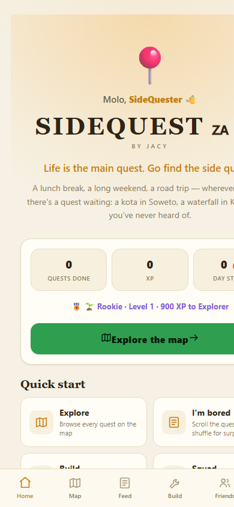
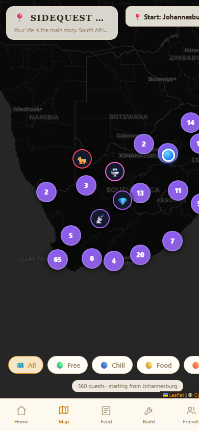
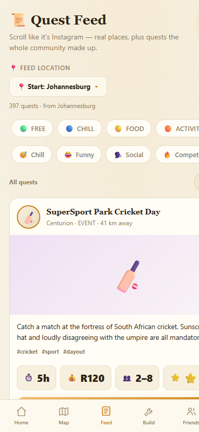
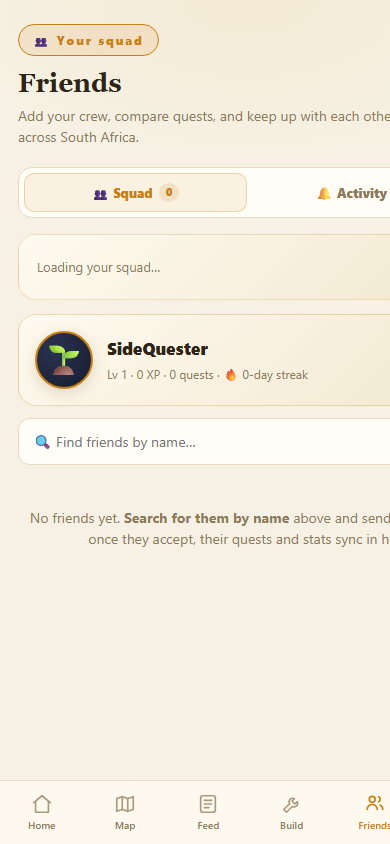

# SIDEQUEST 🇿🇦

**Your life is the main story. South Africa is your map.**

A real-world adventure game that turns the whole country into your playground.
Grab your friends, pick a quest, and go — a lunch break, a long weekend, or a
road trip to nowhere.

 

 

**Play it in any browser** (live demo, no install) **or as a real Android app.**

---

## 🎯 The Problem

South Africa is one of the most beautiful, weird and wonderful countries on
Earth — yet most of us only ever "see" it through a screen.

- **Discovery is passive.** Google Maps lists places, but it never makes you
  *want* to go. A waterfall in KZN, a kota in Soweto, a sunset at Camps Bay —
  they stay photos on a feed instead of afternoons out.
- **Boredom is real.** Students on a lunch break, a free afternoon, or a
  holiday have nowhere obvious to point their energy — so they scroll.
- **Social apps are generic.** Global platforms don't know that a braai on
  Heritage Day or a winter jazz festival in Joburg are the actual highlights of
  a South African week.

SideQuest exists to fix that: **the country is already the playground — we
just needed a reason to go.**

## ✅ The Solution

**SideQuest turns all of South Africa into a game board.** 377 hand-written
quests across all 9 provinces — from a kota hunt in Soweto and a sunset at Zoo
Lake, to lion-watching in the Kruger and a waterfall in KZN. Every quest is a
real place, pinned on a real map, waiting for you to actually show up.

XP, levels, ranks, **46 badges**, friends, squads and streaks turn "going
somewhere" into a game you play with your crew. Seasonal quests tied to real SA
events (Braai Day, Comrades, Splashy Fen, the National Arts Festival…) keep the
map alive all year — with an "Ends Sunday" countdown so you don't miss them.
And real upcoming festivals, markets and motorsport events are quests too —
found **automatically, every night**, with dates, entry fees and exactly where
to buy tickets.

> **Every number you see is real.** No fake "X people loved this" counters —
> ratings come only from players who actually completed the quest.

## 🧭 How It Works

1. **Pick your base.** Set your home from a 19-city picker or hit *Use my
   location* — no sign-up required to play.
2. **Pick a quest.** Browse the map, search any place in the country, or scroll
   the Instagram-style feed filtered by category, budget, distance or date.
3. **Actually go.** Quests are **GPS-gated** — you can only complete one when
   your device is near the place. No completing quests from the couch.
4. **Get rewarded.** XP, levels, ranks (Rookie → Explorer → Trailblazer →
   Legend of SA), badges, streaks and stats — alone or with a squad (+20% XP).
5. **Stay for the events.** The app finds new ticketed events by itself every
   night, so there's always something happening this weekend.

---

## ✨ Features

### 🗺️ Explore the Map
The whole country as a dark game board with every quest pinned in its real
location. **Search** finds any place or quest — local results first, then live
OpenStreetMap for anything else — and flies you straight to it. The map
**survives tile-server outages** by falling back to a backup source instead of
crashing to a blank screen. Auto-discovered events stand out with **pulsing
red LIVE pins** and their own filter chip.

### 📍 Location-first gameplay
Quests are **GPS-gated**: you can only complete one when your device is within
5 km of every stop. Every quest shows a **live drive time** and one-tap
**directions in Google Maps or Waze**.

### 📜 The Quest Feed
Scroll like it's Instagram — real places plus quests the whole community made
up. Pull down to refresh (which also reshuffles and fetches the freshest
events), and filter with one tap:

- **Category** — Free, Chill, Food, Activity, Adventure, Event, Mystery
- **Vibe** — chill, funny, social, competitive, romantic, chaotic, outdoors…
- **Anywhere** — quests with no location, doable right now
- **Community** — quests created by players, platform-wide
- **Seasonal** — limited-time quests with live "Ends Sunday" countdowns
- **🟥 Live** — ticketed sport, concerts & comedy from the nightly feed, with
  a **📅 When** sub-filter: *This weekend* (Fri 5pm–Sun) or *This month*
- **🎪 Festival / 🛍️ Market / 🏎️ Automotive** — real calendar events
- **💰 Budget slider** — filter by price per person, with an adaptive range
  that matches the priciest quest on offer
- **📍 Feed location + radius** — browse quests near a *different* city, with
  nearest-first sorting and ≤25 km / ≤100 km radius filters
- **🔥 Trending** — the most-reviewed quests first

Only **upcoming events** are ever shown — dated events more than ~6 months out
are hidden everywhere, so the feed never reads like a year-ahead schedule.

### 🏆 Progress & Glory
XP, levels and ranks — **Rookie → Explorer → Trailblazer → Legend of SA**.
Daily streaks, a stats dashboard (km covered, quests per category, favourite
province, total hours) and **46 badges** — from Night Owl and Rain Warrior to
the 10km Club, Golden Hour and South Africa Explorer. Tap any badge for its
details and live progress toward the next one.

### ✍️ Creator Titles
Community quest authors earn vanity titles instead of money — *Quest Writer →
Quest Curator → Quest Master → Quest Legend* — shown as a gold chip next to
their name in the feed and tracked on the profile. Community quests are
moderated: blocklist-checked, reportable, and auto-hidden after enough reports.

### 👥 Friends, Squads & Co-op
Add your crew by username and watch real stats sync live. **Squads** bring a
co-op layer: create a squad, invite friends, see the roster update in real
time, and every member earns a **+20% XP bonus** on quests completed together.
The Activity feed surfaces friends' quest completions and badge milestones as
they happen.

### 🔧 Chain Builder
Assemble your own multi-stop quest from the whole catalog, reorder the stops,
and share it as a link that carries the entire quest inside the URL.

### ⭐ Ratings & Reviews (real, moderated)
After completing a quest you can **rate it 1–5 stars** and leave a tip — only
players who actually finished the quest can review it. Reviews are
blocklist-checked, anyone can report one, and a review auto-hides after enough
reports.

### ⏳ Seasonal Quests
Limited-time quests tied to real SA events — Braai Day, the Soweto Food
Festival, Rocking the Daisies, December holidays, Comrades, Splashy Fen, the
National Arts Festival — with a live countdown in the feed and automatic
removal once the event passes.

### 🎟️ Live Events — automatically discovered
SideQuest finds new events **by itself**, every night: real, dated, ticketed
events are pulled from free public sources, placed on real map coordinates,
and merged into the map and feed with ticket links, prices and countdowns —
so there's always something happening this weekend.

- **Tickets built in** — every ticketed event lists exactly where to buy:
  Ticketmaster, Webtickets, Computicket, Ticketpro, Quicket, Howler, iTickets,
  Big Concerts and the festivals' own sites — with a **countdown** ("⏳ 2 days
  left to get tickets", red when ≤ 3 days) so you don't miss out.
- **Works offline** — the event feed is cached, so recent events stay
  available without a connection.
- **Never stale** — past and far-future events are dropped automatically, and
  only events that can be placed accurately are ever shown.

---

## 📸 Screenshots

  
  
  
  

---

## 📲 Get the App

SideQuest runs in any browser — try the live demo above — or as a native
Android app with full GPS support.

**Install on Android:** download the APK from the [releases page](https://github.com/JacyFleisie/sidequest/releases/latest), enable *"Install unknown apps"* for your browser or file manager when prompted, and open the file.

Once installed, the app **updates itself** — it checks for a newer version on
launch and offers a one-tap install, with a notification announcing each new
release.

---

## 🗺️ Roadmap

- [x] Friends & real-time activity feed
- [x] Ratings & reviews (completion-gated, moderated)
- [x] Squads — co-op XP bonus, live roster
- [x] Seasonal quests tied to real SA events
- [x] Auto-discovered live events (nightly pipeline)
- [x] Account deletion (POPIA-friendly)
- [ ] Google Play Store listing (kills sideload warnings + unlocks push reliability)
- [ ] Localization — badge & rank names in isiZulu / Afrikaans
- [ ] Offline caching of map tiles (data-friendly mode)
- [ ] Expanded automated testing

---

## 🔒 Security

- Your data is private — you can only ever read or write your own data (or
  data your friends shared with you).
- Sign-up is protected against bots.
- Your **GPS stays on-device** — quest completion is checked locally; only
  your chosen home base and quest stats ever sync.
- **POPIA-friendly** — you can delete your account and all your data from the
  Profile tab at any time.
- Found a vulnerability? See [SECURITY.md](SECURITY.md) — and please don't
  open a public issue for it.

---

## 📄 License

[MIT](LICENSE) © 2026 Jacy Fleisie

All interactions are governed by our [Code of Conduct](CODE_OF_CONDUCT.md).
